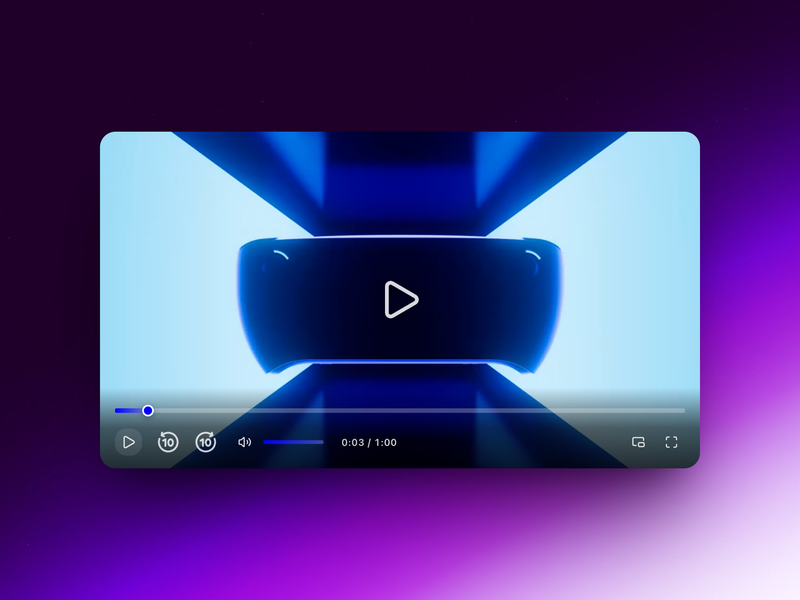
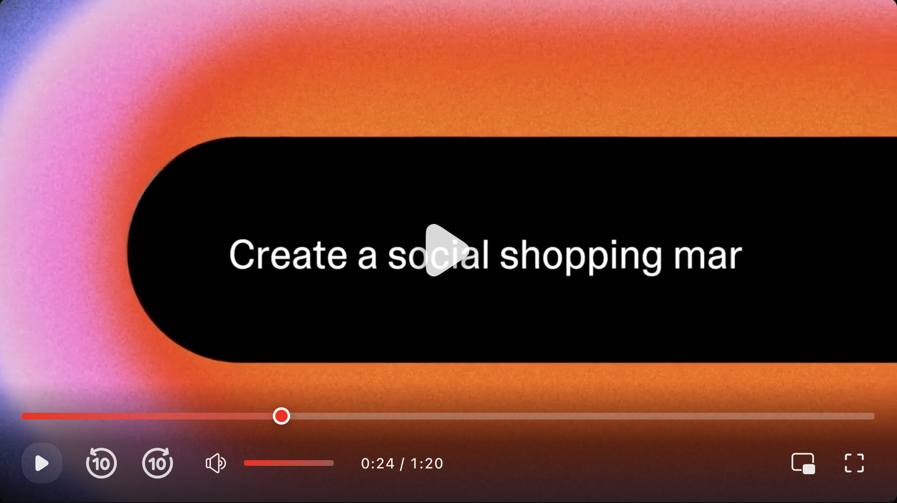

# ReactNextPlayer 🎬

A modern, customizable React video player component with advanced controls, keyboard shortcuts, fullscreen, and picture-in-picture support.




---

## ✨ Features

* 🎛️ Customizable player UI with color theming
* ⏯️ Play / Pause with overlay and controls
* ⏪ Skip backward & ⏩ skip forward (10s)
* 🔊 Volume control with mute/unmute
* ⌨️ Keyboard shortcuts (space, arrows, volume)
* 🖼️ Picture-in-Picture support
* 🖥️ Fullscreen toggle
* 🕒 Progress bar with seek & scrub
* 📱 Responsive design (mobile-friendly)
* ♿ Accessible with keyboard navigation & ARIA labels

---

## 📦 Installation

```bash
npm install reactnextplayer
```

or with Yarn:

```bash
yarn add reactnextplayer
```

---

## 🚀 Usage

```tsx
"use client";
import React from "react";
import {ReactNextPlayer} from "reactnextplayer";

export default function App() {
  return (
    <div style={{ maxWidth: "800px", margin: "0 auto" }}>
      <ReactNextPlayer
        src="/sample-video.mp4"
        poster="/poster-image.jpg"
        autoplay={false}
        controls
        color="#ff4757"
        onPlay={() => console.log("Video started")}
        onPause={() => console.log("Video paused")}
        onEnded={() => console.log("Video ended")}
        onTimeUpdate={(t) => console.log("Current time:", t)}
      />
    </div>
  );
}
```

---

## ⚙️ Props

| Prop          | Type               | Default      | Description                                 |
| ------------- | ------------------ | ------------ | ------------------------------------------- |
| `src`         | `string`           | **required** | Video source URL (mp4, webm, etc.)          |
| `controls`    | `boolean`          | `true`       | Show/hide player controls                   |
| `autoplay`    | `boolean`          | `false`      | Auto play video on load                     |
| `muted`       | `boolean`          | `false`      | Start muted                                 |
| `loop`        | `boolean`          | `false`      | Loop video when finished                    |
| `contextMenu` | `boolean`          | `false`      | Allow right-click menu (disable by default) |
| `poster`      | `string`           | `undefined`  | Poster image before video starts            |
| `width`       | `string \| number` | `"100%"`     | Width of player                             |
| `height`      | `string \| number` | `"auto"`     | Height of player                            |
| `className`   | `string`           | `""`         | Custom CSS class                            |
| `color`       | `string`           | `"#ff0000"`  | Primary color (progress, volume, etc.)      |
| `skipSeconds` | `number`  | `10` | Custom forward and backward skip value (in seconds)

---

## 🎯 Events (Callbacks)

| Event          | Arguments                | Description                     |
| -------------- | ------------------------ | ------------------------------- |
| `onPlay`       | `() => void`             | Fires when video starts playing |
| `onPause`      | `() => void`             | Fires when video is paused      |
| `onTimeUpdate` | `(time: number) => void` | Fires as video time updates     |
| `onEnded`      | `() => void`             | Fires when video playback ends  |

---

## 🎹 Keyboard Shortcuts

| Key         | Action            |
| ----------- | ----------------- |
| `Space`     | Play / Pause      |
| `←` (Left)  | Skip backward 10s |
| `→` (Right) | Skip forward 10s  |
| `↑` (Up)    | Volume up         |
| `↓` (Down)  | Volume down       |

---

## 🎨 Customization

The player uses CSS variables for theming. Pass a `color` prop to change the theme.

```tsx
<ReactNextPlayer
  src="/video.mp4"
  color="#1e90ff" // Blue themed player
/>
```

---

## 📱 Responsive Design

The player is responsive and adapts to different screen sizes:

* **Desktop** → Full controls with hover animations
* **Tablet** → Compact layout
* **Mobile** → Simplified controls & smaller progress bar

---

## 🛠️ Roadmap

* ✅ Customizable control layouts
* ⏳ Subtitles / captions support
* ⏳ Playlist & chapters
* ⏳ HLS / DASH streaming support

---

## 📄 License

MIT License © 2025 \Rakibur Rahaman 
